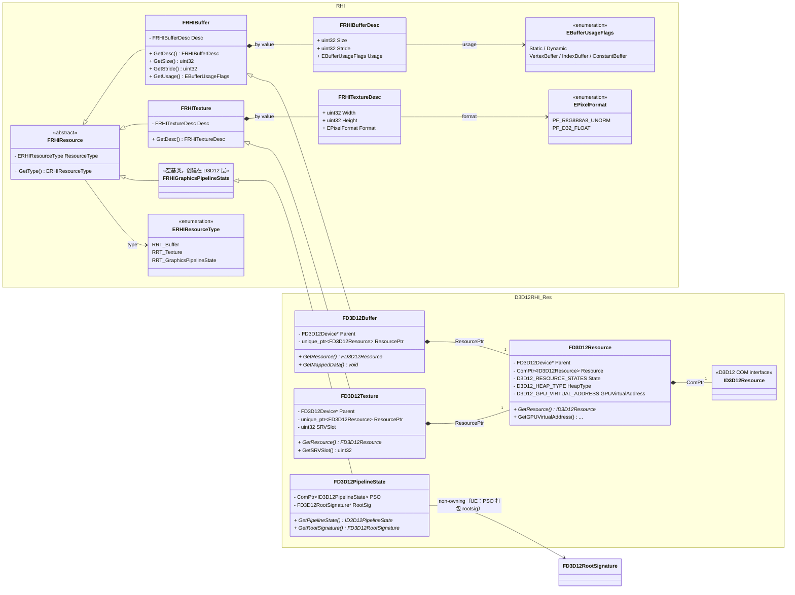
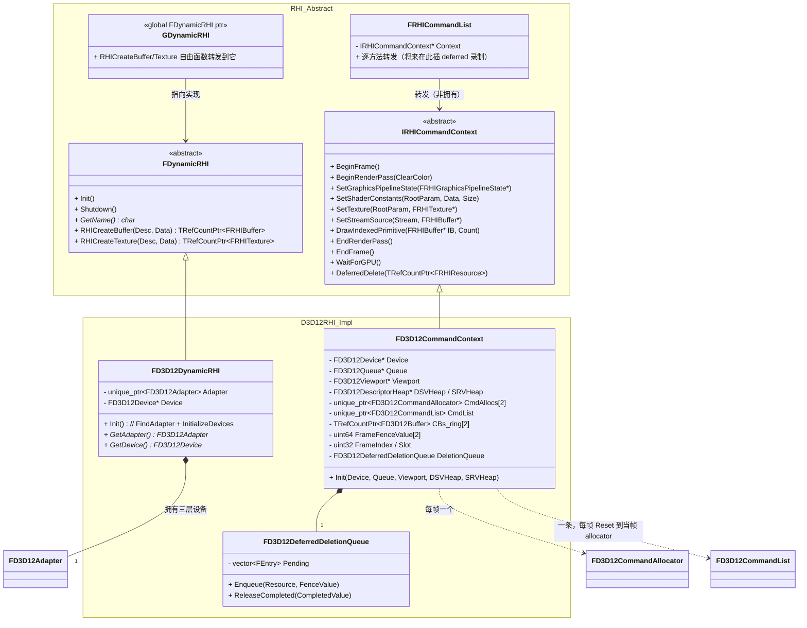
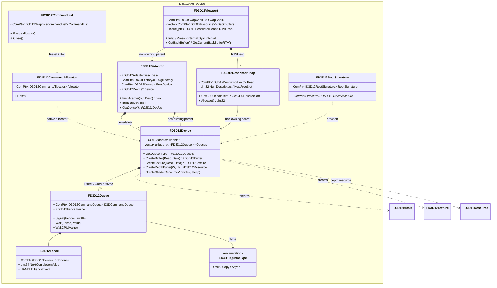
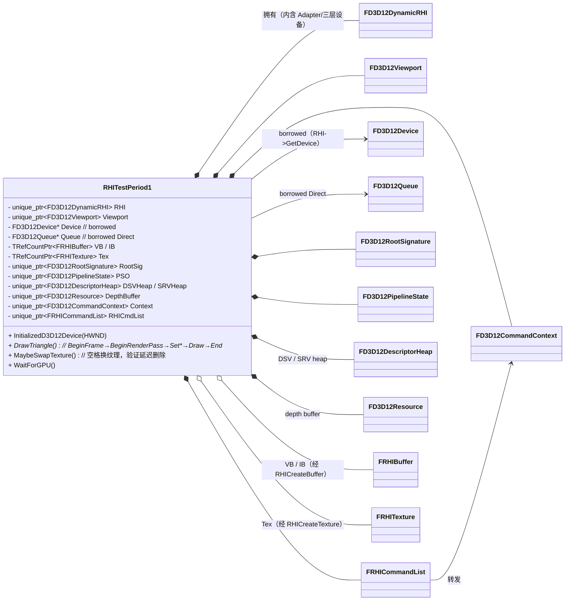

# RHI 与 D3D12RHI UML 类图

> 依据 `Source/RHI/Public`、`Source/D3D12RHI/Public` 及 `Source/RHITest/main.cpp` 的当前实现整理。
>
> 图例：`<|--` 为继承；`*--` 为独占所有权（析构时一并释放）；`o--` 为聚合/共享持有；`-->` 为非拥有的使用/回指；`..>` 为创建或参数依赖。

## 一、资源抽象与 D3D12 实现

RHI 层只暴露基类型（无任何 D3D12 类型）；D3D12 层继承并持有原生对象。`FRHIGraphicsPipelineState` 是为让命令列表能以 RHI 类型接收 PSO 而加的薄基类，创建仍在 D3D12 层具体做。

## 二、RHI 抽象层：DynamicRHI + CommandList（接口/实现分离）

上层只认 `FDynamicRHI`（资源创建）与 `FRHICommandList`（命令录制），不知道背后是 D3D12。`FD3D12DynamicRHI` 持有 `FD3D12Adapter`，是三层设备的拥有者；`FD3D12CommandContext` 持有帧资源（N 分配器 + CmdList + CB ring + 每帧 fence）、延迟删除队列，并借用 Viewport/DSV/SRV 堆。两层为将来多线程（命令缓存 + RHI 线程重放）留缝。

## 三、D3D12 设备、提交与呈现

## 四、当前调用入口

`RHITestPeriod1` 是示例层，不属于 RHI 模块。经过 A2/A2-b 后它的 draw loop **零裸 D3D12 调用**：资源经 `RHICreateBuffer/RHICreateTexture` 建立，命令经 `RHICmdList` 录制。`FD3D12DynamicRHI` 现在是三层设备的拥有者（Adapter 从示例层挪进它）；`FD3D12CommandContext` 拥有帧资源与延迟删除队列。示例层仍持有的具体 D3D12 对象（RootSig/PSO/SRV 堆/DSV 堆/深度资源/Viewport）属过渡态，将在 A2-b 片2/片3 逐步抽掉。

## 五、几点说明（当前简化 / 欠账）

- `TRefCountPtr` 当前等价于 `std::shared_ptr`（基础类型别名），故缓冲/纹理为共享持有；延迟删除队列靠"多持一份 shared_ptr 拷贝"保活到 GPU 越过 fence（UE 用侵入式引用计数 + `MarkForDelete`）。
- **多帧同步（M4-a）**：`FD3D12CommandContext` 用 N=2 的分配器/CB ring + 每帧 fence，提交后只记 `FrameFenceValue[Slot]` 不等，复用前 `WaitCPU`；退出走 `WaitForGPU`。
- **延迟释放（M4-b）**：`DeferredDelete` 入队用"当前帧将 signal 的 fence 值"（保守上界）；`BeginFrame` 每帧 drain 已完成的。资源级 `LastUsedFrameFence` 精确追踪未做。
- **barrier 仍手写**（在 `BeginRenderPass/EndRenderPass` 内），状态自动追踪属阶段 B（RHICore），未做。
- **SRV 绑定 / 描述符槽回收**：SRV 靠 `Tex->GetSRVSlot()`；`FD3D12DescriptorHeap::Allocate` 线性只增、不回收（换纹理会泄漏槽）。SRV 创建/绑定的抽象与槽回收留 A2-b 片3 / 描述符管理。
- **仍具体（过渡）**：PSO/RootSignature/RenderPass 的**创建**、`SetShaderConstants`（root CBV + CB ring，UE 用 UniformBuffer）。留 A2-b 片2。
