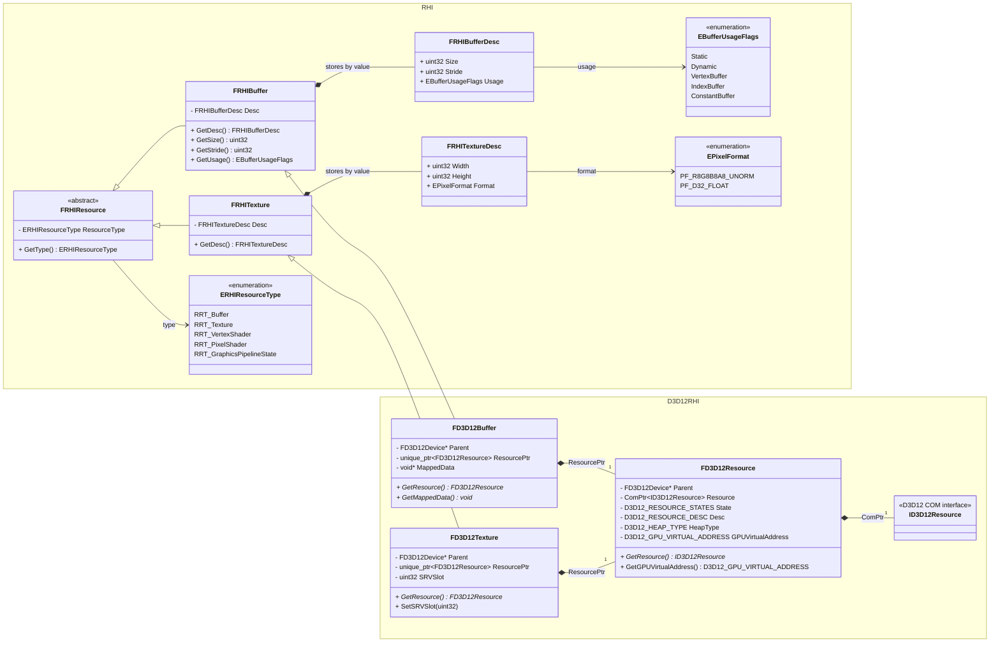
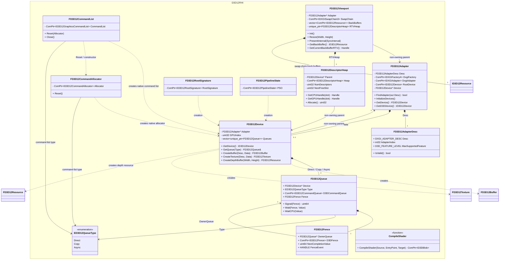
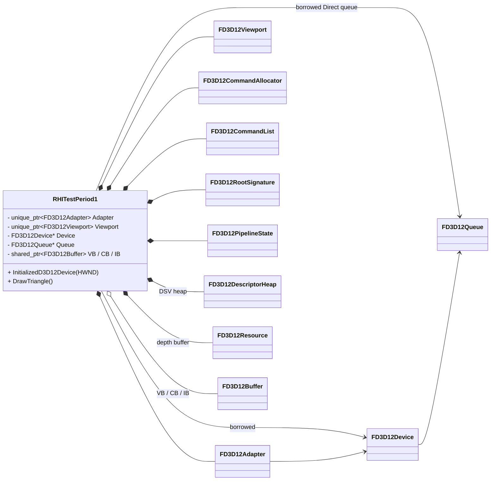

# RHI 与 D3D12RHI UML 类图

> 依据 `Source/RHI/Public`、`Source/D3D12RHI/Public` 及 `Source/RHITest/main.cpp` 的当前实现整理。
>
> 图例：`<|--` 为继承；`*--` 为独占所有权（析构时一并释放）；`o--` 为聚合；`-->` 为非拥有的使用/回指；`..>` 为创建或参数依赖。

## 资源抽象与 D3D12 实现

## D3D12 设备、提交与呈现

## 当前调用入口

`RHITestPeriod1` 是示例层而不是 RHI 模块的一部分。它拥有 `FD3D12Adapter`、`FD3D12Viewport`、根签名、PSO、命令分配器/列表、深度资源和描述符堆；`Device` 与 Direct `Queue` 只是从 `Adapter` 取得的非拥有指针。

`TRefCountPtr` 在当前代码中等价于 `std::shared_ptr`（在项目的基础类型定义中别名）；上图因此将缓冲区表示为共享拥有关系。`FD3D12Resource` 的资源状态目前只在类内保存，尚未公开状态转换接口，示例程序中的 back-buffer barrier 仍直接操作 D3D12 原生资源。
