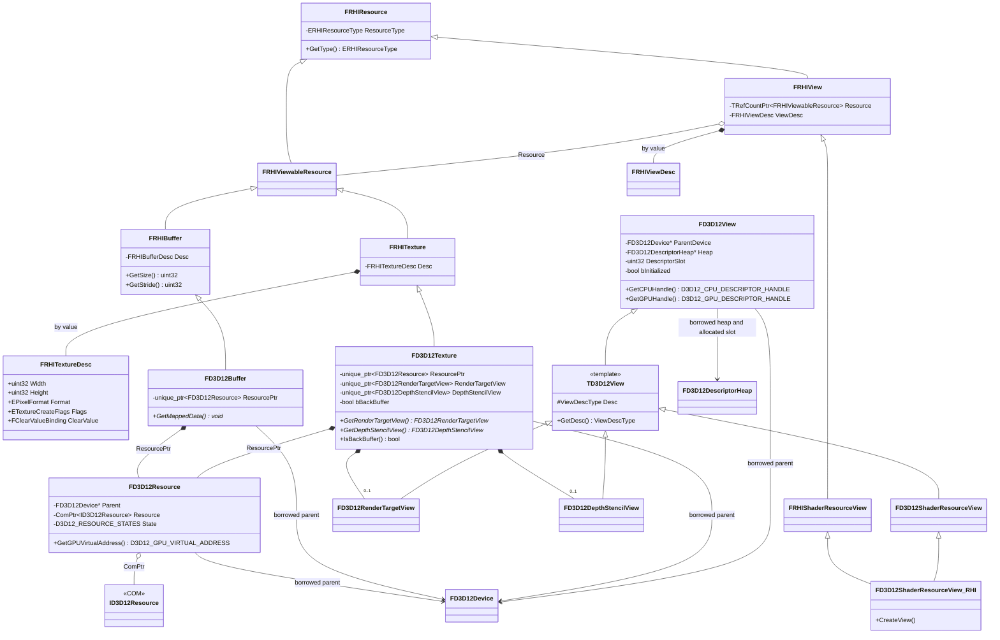
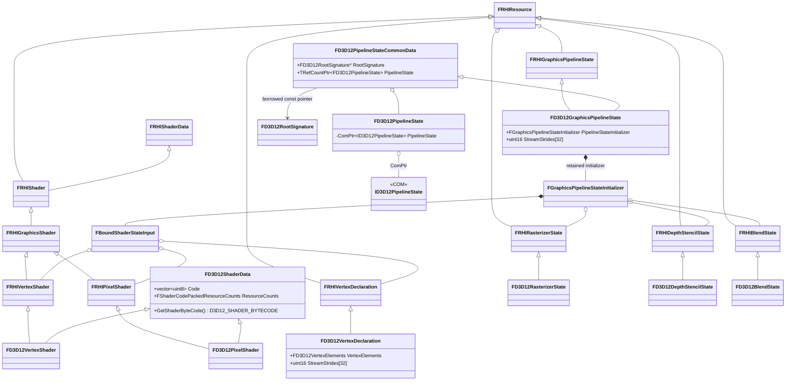
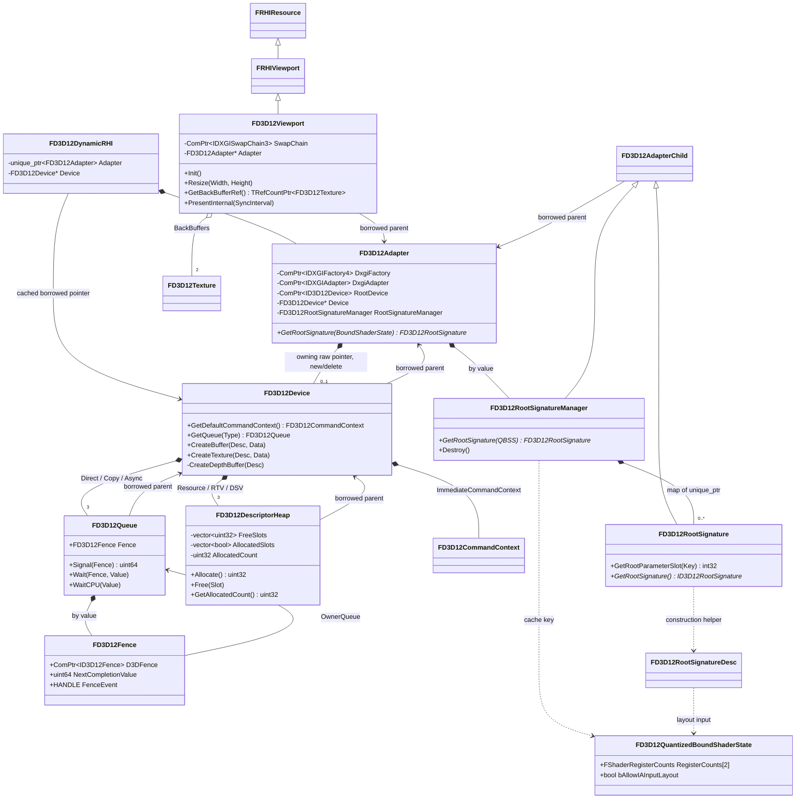
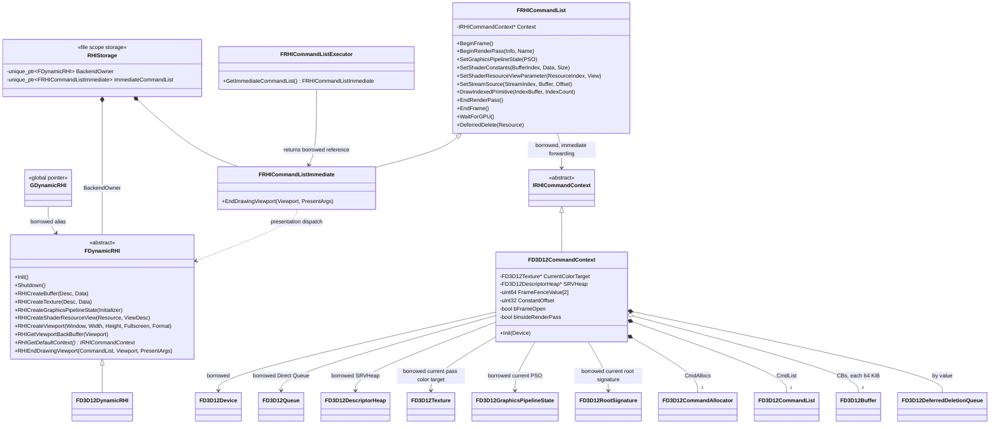
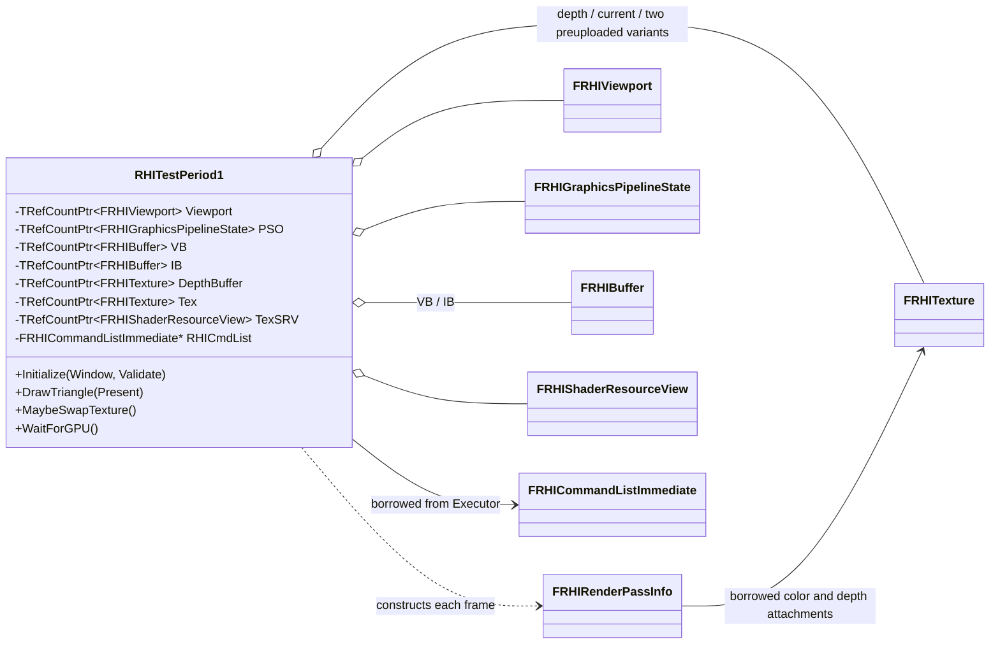
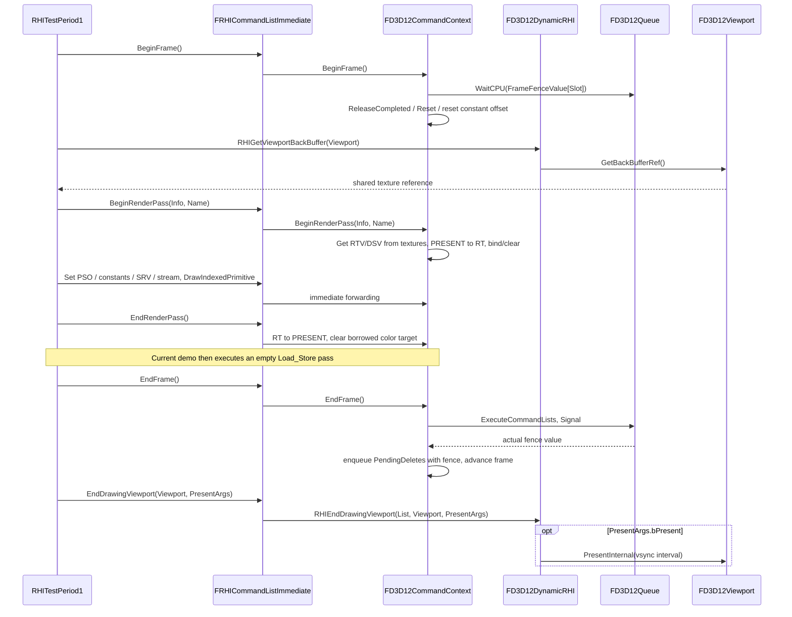

# RHI 与 D3D12RHI UML 类图

> 更新于 2026-09-27，依据当前 `Source/RHI/Public`、`Source/D3D12RHI/Public` 和 `Source/RHITest` 源码。
> 阶段 A 已按教学范围收尾；详细变更、验收和简化边界见 [StageA_Completion.md](StageA_Completion.md)。这里描述的是项目当前实现，不是 UE 完整类图。
>
> 图例：`<|--` 继承；`*--` 独占拥有或按值成员；`o--` 引用计数持有；`-->` 非拥有指针/使用关系；`..>` 创建或参数依赖。`TRefCountPtr` 当前为共享引用别名；原生 COM 对象由 `ComPtr` 引用计数持有。
> 为控制图的大小，省略导出宏、部分访问器与校验代码。模板层的不同实例合并为一个节点，不表示不同 View 共用同一个对象。

## 一、资源、纹理与 View

Buffer 与 Texture 都继承 `FRHIViewableResource`。独立 SRV 的 RHI 部分持有资源引用，后端部分保存描述符；RTV/DSV 则直接由后端纹理拥有。Texture 已没有 `SRVSlot`，SRV 的创建和绑定不再依赖纹理内置槽位。

```mermaid
classDiagram
direction TB
class FRHIResource {
    -ERHIResourceType ResourceType
    +GetType() ERHIResourceType
}
class FRHIViewableResource
class FRHIBuffer {
    -FRHIBufferDesc Desc
    +GetSize() uint32
    +GetStride() uint32
}
class FRHITexture {
    -FRHITextureDesc Desc
}
class FRHITextureDesc {
    +uint32 Width
    +uint32 Height
    +EPixelFormat Format
    +ETextureCreateFlags Flags
    +FClearValueBinding ClearValue
}
class FRHIView {
    -TRefCountPtr~FRHIViewableResource~ Resource
    -FRHIViewDesc ViewDesc
}
class FRHIViewDesc
class FRHIShaderResourceView
class FD3D12Buffer {
    -unique_ptr~FD3D12Resource~ ResourcePtr
    +GetMappedData() void*
}
class FD3D12Texture {
    -unique_ptr~FD3D12Resource~ ResourcePtr
    -unique_ptr~FD3D12RenderTargetView~ RenderTargetView
    -unique_ptr~FD3D12DepthStencilView~ DepthStencilView
    -bool bBackBuffer
    +GetRenderTargetView() FD3D12RenderTargetView*
    +GetDepthStencilView() FD3D12DepthStencilView*
    +IsBackBuffer() bool
}
class FD3D12Resource {
    -FD3D12Device* Parent
    -ComPtr~ID3D12Resource~ Resource
    -D3D12_RESOURCE_STATES State
    +GetGPUVirtualAddress() D3D12_GPU_VIRTUAL_ADDRESS
}
class FD3D12View {
    -FD3D12Device* ParentDevice
    -FD3D12DescriptorHeap* Heap
    -uint32 DescriptorSlot
    -bool bInitialized
    +GetCPUHandle() D3D12_CPU_DESCRIPTOR_HANDLE
    +GetGPUHandle() D3D12_GPU_DESCRIPTOR_HANDLE
}
class TD3D12View {
    <<template>>
    #ViewDescType Desc
    +GetDesc() ViewDescType
}
class FD3D12RenderTargetView
class FD3D12DepthStencilView
class FD3D12ShaderResourceView
class FD3D12ShaderResourceView_RHI {
    +CreateView()
}
class ID3D12Resource {
    <<COM>>
}

FRHIResource <|-- FRHIViewableResource
FRHIViewableResource <|-- FRHIBuffer
FRHIViewableResource <|-- FRHITexture
FRHIResource <|-- FRHIView
FRHIView <|-- FRHIShaderResourceView
FRHITexture *-- FRHITextureDesc : by value
FRHIView *-- FRHIViewDesc : by value
FRHIView o-- FRHIViewableResource : Resource
FRHIBuffer <|-- FD3D12Buffer
FRHITexture <|-- FD3D12Texture
FD3D12Buffer *-- FD3D12Resource : ResourcePtr
FD3D12Texture *-- FD3D12Resource : ResourcePtr
FD3D12Texture *-- "0..1" FD3D12RenderTargetView
FD3D12Texture *-- "0..1" FD3D12DepthStencilView
FD3D12Resource o-- ID3D12Resource : ComPtr
FD3D12View <|-- TD3D12View
TD3D12View <|-- FD3D12RenderTargetView
TD3D12View <|-- FD3D12DepthStencilView
TD3D12View <|-- FD3D12ShaderResourceView
FRHIShaderResourceView <|-- FD3D12ShaderResourceView_RHI
FD3D12ShaderResourceView <|-- FD3D12ShaderResourceView_RHI
FD3D12View --> FD3D12DescriptorHeap : borrowed heap and allocated slot
FD3D12Resource --> FD3D12Device : borrowed parent
FD3D12Buffer --> FD3D12Device : borrowed parent
FD3D12Texture --> FD3D12Device : borrowed parent
FD3D12View --> FD3D12Device : borrowed parent
```

- `FD3D12ShaderResourceView_RHI` 的两条继承链分别负责 RHI 身份/资源引用和后端描述符，不是两个独立分配的 View。
- `TD3D12View<ViewType, ViewDescType>` 保存对应的原生描述。当前支持 Texture2D RGBA8 SRV/RTV、D32 DSV，单 mip、非数组、单采样。
- RTV/DSV 只用 CPU handle；SRV 使用 shader-visible 资源堆的 CPU/GPU handle。对非 shader-visible View 调用 `GetGPUHandle()` 会报错。
- 纹理中的 View 成员在 `ResourcePtr` 后声明，因此先于资源析构。View 析构归还槽位，Device 的堆必须仍存活。
- `FD3D12Resource::State` 当前记录构造状态，不代表通用运行时状态追踪已经实现。

## 二、Shader、顶点声明、固定状态与 PSO

RHI 创建入口已经覆盖 Shader、顶点声明、固定状态与图形 PSO。真正继承 `FRHIGraphicsPipelineState` 的是 `FD3D12GraphicsPipelineState`；底层 `FD3D12PipelineState` 只封装原生 PSO。

```mermaid
classDiagram
direction TB
class FRHIResource
class FRHIShaderData
class FRHIShader
class FRHIGraphicsShader
class FRHIVertexShader
class FRHIPixelShader
class FD3D12ShaderData {
    +vector~uint8~ Code
    +FShaderCodePackedResourceCounts ResourceCounts
    +GetShaderByteCode() D3D12_SHADER_BYTECODE
}
class FD3D12VertexShader
class FD3D12PixelShader
class FRHIVertexDeclaration
class FD3D12VertexDeclaration {
    +FD3D12VertexElements VertexElements
    +uint16 StreamStrides[32]
}
class FRHIRasterizerState
class FRHIDepthStencilState
class FRHIBlendState
class FD3D12RasterizerState
class FD3D12DepthStencilState
class FD3D12BlendState
class FBoundShaderStateInput
class FGraphicsPipelineStateInitializer
class FRHIGraphicsPipelineState
class FD3D12GraphicsPipelineState {
    +FGraphicsPipelineStateInitializer PipelineStateInitializer
    +uint16 StreamStrides[32]
}
class FD3D12PipelineStateCommonData {
    +FD3D12RootSignature* RootSignature
    +TRefCountPtr~FD3D12PipelineState~ PipelineState
}
class FD3D12PipelineState {
    -ComPtr~ID3D12PipelineState~ PipelineState
}
class ID3D12PipelineState {
    <<COM>>
}

FRHIResource <|-- FRHIShader
FRHIShaderData <|-- FRHIShader
FRHIShader <|-- FRHIGraphicsShader
FRHIGraphicsShader <|-- FRHIVertexShader
FRHIGraphicsShader <|-- FRHIPixelShader
FRHIVertexShader <|-- FD3D12VertexShader
FRHIPixelShader <|-- FD3D12PixelShader
FD3D12ShaderData <|-- FD3D12VertexShader
FD3D12ShaderData <|-- FD3D12PixelShader
FRHIResource <|-- FRHIVertexDeclaration
FRHIVertexDeclaration <|-- FD3D12VertexDeclaration
FRHIResource <|-- FRHIRasterizerState
FRHIResource <|-- FRHIDepthStencilState
FRHIResource <|-- FRHIBlendState
FRHIRasterizerState <|-- FD3D12RasterizerState
FRHIDepthStencilState <|-- FD3D12DepthStencilState
FRHIBlendState <|-- FD3D12BlendState
FRHIResource <|-- FRHIGraphicsPipelineState
FRHIGraphicsPipelineState <|-- FD3D12GraphicsPipelineState
FD3D12PipelineStateCommonData <|-- FD3D12GraphicsPipelineState
FD3D12GraphicsPipelineState *-- FGraphicsPipelineStateInitializer : retained initializer
FGraphicsPipelineStateInitializer *-- FBoundShaderStateInput
FBoundShaderStateInput o-- FRHIVertexDeclaration
FBoundShaderStateInput o-- FRHIVertexShader
FBoundShaderStateInput o-- FRHIPixelShader
FGraphicsPipelineStateInitializer o-- FRHIRasterizerState
FGraphicsPipelineStateInitializer o-- FRHIDepthStencilState
FGraphicsPipelineStateInitializer o-- FRHIBlendState
FD3D12PipelineStateCommonData o-- FD3D12PipelineState
FD3D12PipelineStateCommonData --> FD3D12RootSignature : borrowed const pointer
FD3D12PipelineState o-- ID3D12PipelineState : ComPtr
```

顶点步长取自当前 PSO 的 `StreamStrides`。`SetStreamSource` 的 Offset 只影响 VBV 地址与可读字节数，不从 Stride 中扣除。Shader 资源数量当前由测试显式填写，尚未接入完整编译产物元数据解析。

## 三、Adapter、Device、Queue 与根签名缓存

Device 拥有三种描述符堆和默认 Context。Viewport 由上层共享持有，借用 Adapter；它不拥有 Context，也不再拥有 RTV 堆。

```mermaid
classDiagram
direction TB
class FD3D12DynamicRHI {
    -unique_ptr~FD3D12Adapter~ Adapter
    -FD3D12Device* Device
}
class FD3D12Adapter {
    -ComPtr~IDXGIFactory4~ DxgiFactory
    -ComPtr~IDXGIAdapter~ DxgiAdapter
    -ComPtr~ID3D12Device~ RootDevice
    -FD3D12Device* Device
    -FD3D12RootSignatureManager RootSignatureManager
    +GetRootSignature(BoundShaderState) FD3D12RootSignature*
}
class FD3D12Device {
    +GetDefaultCommandContext() FD3D12CommandContext
    +GetQueue(Type) FD3D12Queue
    +CreateBuffer(Desc, Data)
    +CreateTexture(Desc, Data)
    -CreateDepthBuffer(Desc)
}
class FD3D12Queue {
    +FD3D12Fence Fence
    +Signal(Fence) uint64
    +Wait(Fence, Value)
    +WaitCPU(Value)
}
class FD3D12Fence {
    +ComPtr~ID3D12Fence~ D3DFence
    +uint64 NextCompletionValue
    +HANDLE FenceEvent
}
class FD3D12DescriptorHeap {
    -vector~uint32~ FreeSlots
    -vector~bool~ AllocatedSlots
    -uint32 AllocatedCount
    +Allocate() uint32
    +Free(Slot)
    +GetAllocatedCount() uint32
}
class FD3D12CommandContext
class FRHIResource
class FRHIViewport
class FD3D12Viewport {
    -ComPtr~IDXGISwapChain3~ SwapChain
    -FD3D12Adapter* Adapter
    +Init()
    +Resize(Width, Height)
    +GetBackBufferRef() TRefCountPtr~FD3D12Texture~
    +PresentInternal(SyncInterval)
}
class FD3D12Texture
class FD3D12AdapterChild
class FD3D12RootSignatureManager {
    +GetRootSignature(QBSS) FD3D12RootSignature*
    +Destroy()
}
class FD3D12QuantizedBoundShaderState {
    +FShaderRegisterCounts RegisterCounts[2]
    +bool bAllowIAInputLayout
}
class FD3D12RootSignatureDesc
class FD3D12RootSignature {
    +GetRootParameterSlot(Key) int32
    +GetRootSignature() ID3D12RootSignature*
}

FD3D12DynamicRHI *-- FD3D12Adapter
FD3D12DynamicRHI --> FD3D12Device : cached borrowed pointer
FD3D12Adapter *-- "0..1" FD3D12Device : owning raw pointer, new/delete
FD3D12Device --> FD3D12Adapter : borrowed parent
FD3D12Device *-- "3" FD3D12Queue : Direct / Copy / Async
FD3D12Queue --> FD3D12Device : borrowed parent
FD3D12Queue *-- FD3D12Fence : by value
FD3D12Fence --> FD3D12Queue : OwnerQueue
FD3D12Device *-- "3" FD3D12DescriptorHeap : Resource / RTV / DSV
FD3D12Device *-- FD3D12CommandContext : ImmediateCommandContext
FD3D12DescriptorHeap --> FD3D12Device : borrowed parent
FRHIResource <|-- FRHIViewport
FRHIViewport <|-- FD3D12Viewport
FD3D12Viewport --> FD3D12Adapter : borrowed parent
FD3D12Viewport o-- "2" FD3D12Texture : BackBuffers
FD3D12Adapter *-- FD3D12RootSignatureManager : by value
FD3D12AdapterChild <|-- FD3D12RootSignatureManager
FD3D12AdapterChild <|-- FD3D12RootSignature
FD3D12AdapterChild --> FD3D12Adapter : borrowed parent
FD3D12RootSignatureManager *-- "0..*" FD3D12RootSignature : map of unique_ptr
FD3D12RootSignatureManager ..> FD3D12QuantizedBoundShaderState : cache key
FD3D12RootSignature ..> FD3D12RootSignatureDesc : construction helper
FD3D12RootSignatureDesc ..> FD3D12QuantizedBoundShaderState : layout input
```

- 三个堆当前各 8 槽，支持空闲槽复用，不支持自动扩容；同时存活的 View 超过容量时显式报错。
- 根签名按布局缓存，PSO 只借用根签名指针；当前没有完整底层 PSO 缓存。QBSS 使用 VS/PS 的精确资源计数，尚无 UE 的量化分档。
- `CreateTexture` 分派 RGBA8 ShaderResource 与 D32 DepthStencilTargetable；`CreateDepthBuffer` 是私有辅助函数。SRV 通过 `FDynamicRHI::RHICreateShaderResourceView` 创建。
- Device 声明 Context 成员在堆后面，保证 Context 先于堆与 Queue 析构。上层资源、PSO、Viewport 必须在 `RHIExit` 前释放。

## 四、RHI 启动与命令列表所有权

`RHI.cpp` 的匿名命名空间持有 `BackendOwner` 和 `ImmediateCommandList`。下图中的 `RHIStorage` 只是这个文件级存储的图示名称，源码没有同名类。`GDynamicRHI` 是非拥有全局指针，Executor 也不拥有命令列表。

```mermaid
classDiagram
direction TB
class RHIStorage {
    <<file scope storage>>
    -unique_ptr~FDynamicRHI~ BackendOwner
    -unique_ptr~FRHICommandListImmediate~ ImmediateCommandList
}
class GDynamicRHI {
    <<global pointer>>
}
class FDynamicRHI {
    <<abstract>>
    +Init()
    +Shutdown()
    +RHICreateBuffer(Desc, Data)
    +RHICreateTexture(Desc, Data)
    +RHICreateGraphicsPipelineState(Initializer)
    +RHICreateShaderResourceView(Resource, ViewDesc)
    +RHICreateViewport(Window, Width, Height, Fullscreen, Format)
    +RHIGetViewportBackBuffer(Viewport)
    +RHIGetDefaultContext() IRHICommandContext*
    +RHIEndDrawingViewport(CommandList, Viewport, PresentArgs)
}
class FD3D12DynamicRHI
class FRHICommandListExecutor {
    +GetImmediateCommandList() FRHICommandListImmediate
}
class FRHICommandList {
    -IRHICommandContext* Context
    +BeginFrame()
    +BeginRenderPass(Info, Name)
    +SetGraphicsPipelineState(PSO)
    +SetShaderConstants(BufferIndex, Data, Size)
    +SetShaderResourceViewParameter(ResourceIndex, View)
    +SetStreamSource(StreamIndex, Buffer, Offset)
    +DrawIndexedPrimitive(IndexBuffer, IndexCount)
    +EndRenderPass()
    +EndFrame()
    +WaitForGPU()
    +DeferredDelete(Resource)
}
class FRHICommandListImmediate {
    +EndDrawingViewport(Viewport, PresentArgs)
}
class IRHICommandContext {
    <<abstract>>
}
class FD3D12CommandContext {
    +Init(Device)
    -FD3D12Texture* CurrentColorTarget
    -FD3D12DescriptorHeap* SRVHeap
    -uint64 FrameFenceValue[2]
    -uint32 ConstantOffset
    -bool bFrameOpen
    -bool bInsideRenderPass
}
class FD3D12CommandAllocator
class FD3D12CommandList
class FD3D12Buffer
class FD3D12DeferredDeletionQueue

RHIStorage *-- FDynamicRHI : BackendOwner
RHIStorage *-- FRHICommandListImmediate
GDynamicRHI --> FDynamicRHI : borrowed alias
FDynamicRHI <|-- FD3D12DynamicRHI
FRHICommandList <|-- FRHICommandListImmediate
FRHICommandListExecutor --> FRHICommandListImmediate : returns borrowed reference
FRHICommandList --> IRHICommandContext : borrowed, immediate forwarding
IRHICommandContext <|-- FD3D12CommandContext
FRHICommandListImmediate ..> FDynamicRHI : presentation dispatch
FD3D12CommandContext --> FD3D12Device : borrowed
FD3D12CommandContext --> FD3D12Queue : borrowed Direct Queue
FD3D12CommandContext --> FD3D12DescriptorHeap : borrowed SRVHeap
FD3D12CommandContext --> FD3D12Texture : borrowed current pass color target
FD3D12CommandContext --> FD3D12GraphicsPipelineState : borrowed current PSO
FD3D12CommandContext --> FD3D12RootSignature : borrowed current root signature
FD3D12CommandContext *-- "2" FD3D12CommandAllocator : CmdAllocs
FD3D12CommandContext *-- "1" FD3D12CommandList : CmdList
FD3D12CommandContext o-- "2" FD3D12Buffer : CBs, each 64 KiB
FD3D12CommandContext *-- FD3D12DeferredDeletionQueue : by value
```

`RHIGetDefaultContext` 只用于 RHI 内部初始化；测试通过 Executor 获取命令列表。Context 不保存 Viewport 或 DSV 堆。每帧常量区按绑定次数分配 256 字节对齐片段，帧槽复用前等待对应 Fence。

## 五、示例层、RenderPass 与呈现调用链

`RHITestPeriod1` 不再拥有具体后端、Context 或命令列表。`TestPlatform.cpp` 负责选择后端和返回编译字节码；`BackendValidation.cpp` 使用原生接口做专门验证。这两者是测试适配/诊断代码，不是普通绘制层。

```mermaid
classDiagram
direction LR
class RHITestPeriod1 {
    -TRefCountPtr~FRHIViewport~ Viewport
    -TRefCountPtr~FRHIGraphicsPipelineState~ PSO
    -TRefCountPtr~FRHIBuffer~ VB
    -TRefCountPtr~FRHIBuffer~ IB
    -TRefCountPtr~FRHITexture~ DepthBuffer
    -TRefCountPtr~FRHITexture~ Tex
    -TRefCountPtr~FRHIShaderResourceView~ TexSRV
    -FRHICommandListImmediate* RHICmdList
    +Initialize(Window, Validate)
    +DrawTriangle(Present)
    +MaybeSwapTexture()
    +WaitForGPU()
}
class FRHIRenderPassInfo
class FRHITexture
class FRHIViewport
class FRHIGraphicsPipelineState
class FRHIBuffer
class FRHIShaderResourceView
class FRHICommandListImmediate
RHITestPeriod1 o-- FRHIViewport
RHITestPeriod1 o-- FRHIGraphicsPipelineState
RHITestPeriod1 o-- FRHIBuffer : VB / IB
RHITestPeriod1 o-- FRHITexture : depth / current / two preuploaded variants
RHITestPeriod1 o-- FRHIShaderResourceView
RHITestPeriod1 --> FRHICommandListImmediate : borrowed from Executor
RHITestPeriod1 ..> FRHIRenderPassInfo : constructs each frame
FRHIRenderPassInfo --> FRHITexture : borrowed color and depth attachments
```

RenderPass 描述保存附件裸指针和 Load/Store 动作；清除值来自纹理的 `FClearValueBinding`。当前只接受一个 backbuffer + D32，支持 Clear_Store / Load_Store。`DrawTriangle` 保留历史函数名，实际绘制纹理立方体。

```mermaid
sequenceDiagram
participant App as RHITestPeriod1
participant List as FRHICommandListImmediate
participant Context as FD3D12CommandContext
participant RHI as FD3D12DynamicRHI
participant Queue as FD3D12Queue
participant VP as FD3D12Viewport
App->>List: BeginFrame()
List->>Context: BeginFrame()
Context->>Queue: WaitCPU(FrameFenceValue[Slot])
Context->>Context: ReleaseCompleted / Reset / reset constant offset
App->>RHI: RHIGetViewportBackBuffer(Viewport)
RHI->>VP: GetBackBufferRef()
VP-->>App: shared texture reference
App->>List: BeginRenderPass(Info, Name)
List->>Context: BeginRenderPass(Info, Name)
Context->>Context: Get RTV/DSV from textures, PRESENT to RT, bind/clear
App->>List: Set PSO / constants / SRV / stream, DrawIndexedPrimitive
List->>Context: immediate forwarding
App->>List: EndRenderPass()
List->>Context: RT to PRESENT, clear borrowed color target
Note over App,Context: Current demo then executes an empty Load_Store pass
App->>List: EndFrame()
List->>Context: EndFrame()
Context->>Queue: ExecuteCommandLists, Signal
Queue-->>Context: actual fence value
Context->>Context: enqueue PendingDeletes with fence, advance frame
App->>List: EndDrawingViewport(Viewport, PresentArgs)
List->>RHI: RHIEndDrawingViewport(List, Viewport, PresentArgs)
opt PresentArgs.bPresent
RHI->>VP: PresentInternal(vsync interval)
end
```

当前 `EndFrame` 提交后才调用呈现入口，这是单线程教学版的时序约定。UE 的线程调度和提交管线更复杂，不能把此图当作 UE 完整的提交时序。

## 六、延迟释放与描述符复用

关键点是先保留引用，再用实际提交返回的 Fence 标记。不是在 `DeferredDelete` 时猜测“下一帧 Fence”。资源不会因为已进 DeletionQueue 就立即析构，只有已完成条目被移除且最后一个引用消失，才释放 View 和槽位。

```mermaid
sequenceDiagram
participant App as Upper-level owner
participant Context as FD3D12CommandContext
participant Pending as PendingDeletes
participant Queue as Direct Queue / Fence
participant Deletes as FD3D12DeferredDeletionQueue
participant View as SRV RHI wrapper
participant Heap as ResourceDescriptorHeap
App->>Context: DeferredDelete(old SRV)
Context->>Pending: retain TRefCountPtr
App->>App: drop old SRV reference
Note over Pending,View: FRHIView retains texture; both remain alive
Context->>Queue: EndFrame: ExecuteCommandLists, Signal
Queue-->>Context: actual completion value
Context->>Deletes: move pending references, Enqueue(resource, value)
Context->>Pending: clear moved entries
Note over Queue,Deletes: GPU may still use the SRV and its descriptor
Context->>Deletes: BeginFrame: ReleaseCompleted(completed value)
alt fence not complete
Deletes->>Deletes: keep reference, slot remains allocated
else fence complete and last reference removed
Deletes->>View: release reference, destroy View
View->>Heap: Free(DescriptorSlot)
View->>View: release texture reference
end
```

`WaitForGPU` 也会将尚未挂 Fence 的 PendingDeletes 绑定到新 Signal 值，等待后执行 ReleaseCompleted；调用前不得存在未提交的帧。绑定接口不会自动捕获资源引用，释放在飞资源前仍须遵守显式 DeferredDelete 协议。

## 七、当前边界与对照文件

| 主题 | 当前实现 | 后续范围 |
|---|---|---|
| 同步 | 两个帧槽，Direct Queue Fence，复用前等待 | 独立提交/中断线程、并行命令列表 |
| 描述符 | 三种固定容量堆、空闲槽回收、在飞 SRV 延迟析构 | 扩容、offline/online managers、复制缓存、bindless |
| RenderPass | backbuffer + D32，Clear/Load，手写 PRESENT 与 RT 屏障 | 阶段 B 的 ERHIAccess / FRHITransition / 状态追踪 |
| Shader 绑定 | VS b0、PS t0、静态 point/wrap s0 | 完整 Shader 参数与 UniformBuffer 系统、动态采样器 |
| PSO | RHI initializer、后端包装、Adapter 根签名缓存 | 底层 PSO 缓存和完整布局量化 |
| 资源生命周期 | TRefCountPtr、显式 DeferredDelete、Fence 完成后释放 | UE 侵入式计数与更完整的自动生命周期管理 |

本图没有加入尚未实现的 RHI Thread、StateCache、RDG 或通用资源状态机。

源码入口：

- [RHI.cpp](RHI/Public/RHI.cpp)、[DynamicRHI.h](RHI/Public/DynamicRHI.h)、[RHICommandList.h](RHI/Public/RHICommandList.h)：启动所有权、抽象入口和命令转发。
- [RHIResources.h](RHI/Public/RHIResources.h)：资源/View/Shader/PSO/RenderPass 描述。
- [D3D12Device.h](D3D12RHI/Public/D3D12Device.h)、[D3D12CommandContext.h](D3D12RHI/Public/D3D12CommandContext.h)：后端所有权与帧资源。
- [D3D12View.h](D3D12RHI/Public/D3D12View.h)、[D3D12Descriptors.h](D3D12RHI/Public/D3D12Descriptors.h)、[D3D12Resources.h](D3D12RHI/Public/D3D12Resources.h)：视图、槽位和资源。
- [D3D12PipelineState.h](D3D12RHI/Public/D3D12PipelineState.h)、[D3D12RootSignature.h](D3D12RHI/Public/D3D12RootSignature.h)：PSO 分层与根签名缓存。
- [main.cpp](RHITest/main.cpp)、[BackendValidation.cpp](RHITest/BackendValidation.cpp)：RHI 调用示例及后端验收。
